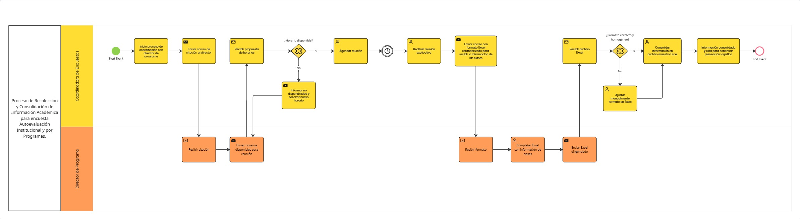

# Informe Técnico del Taller

## Nombre del Taller
_Taller1 - Modelado BPMN del proceso de Recolección y Consolidación de Información Académica para encuesta Autoevaluación Institucional y por Programas._

## Integrantes del equipo
| Nombre | Correo Electrónico |
|---|---|
| Valentina Alejandra López Romero | valentinalopro@unisabana.edu.co |
| Mariana Valle Moreno | marianavamo@unisabana.edu.co |
| Laura Camila Rodriguez Leon | laurarodleo@unisabana.edu.co |

## Descripción general del trabajo

El objetivo del taller fue seleccionar un proceso real del cliente asignado y modelarlo utilizando la notación BPMN, representando fielmente su funcionamiento actual (modelo AS-IS).

El proceso escogido corresponde a la **Recolección y Consolidación de Información Académica para la Encuesta de Autoevaluación Institucional y por Programas**, la cual es considerada una de las mediciones más importantes que realiza la universidad. Este instrumento constituye un insumo fundamental para dar respuesta a los lineamientos establecidos por el Consejo Nacional de Acreditación (CNA), ya que no solo permite identificar oportunidades de mejora, sino que también sirve como soporte estratégico para la toma de decisiones y el aseguramiento de la calidad institucional.

El alcance definido de este proceso comprende desde el envío de la citación al director de programa hasta la recepción, validación y consolidación de un archivo Excel con la información académica requerida para la planeación de la implementación de la encuesta, incluyendo listados de materias, salones, horarios y profesores disponibles por semestre para su aplicación de manera satisfactoria.

El trabajo se desarrolló a partir del análisis del contexto suministrado por el cliente, identificando actividades, responsables, puntos de decisión y posibles reprocesos presentes en el flujo actual.

## Proceso de desarrollo 

Para el modelado del proceso se siguieron los siguientes pasos:

### 1. Delimitación del alcance  

A través del contexto proporcionado por el cliente se identificó que el macroproceso de la encuesta incluía múltiples subprocesos. Por esta razón, se decidió acotar el análisis únicamente al flujo relacionado con la citación, la reunión explicativa y la recepción de información académica por parte de los directores de cada programa.

### 2. Identificación de actores  

Una vez delimitado el proceso, se identificaron los actores principales involucrados en el flujo:

- **Coordinadora de Encuestas**
- **Director de Programa**

Esta separación nos permitió asignar responsabilidades claras a cada actor.

### 3. Estructuración del flujo  

Posteriormente, se procedió a listar y organizar las actividades que componen el proceso, identificando la secuencia lógica en la que ocurren. Entre las principales actividades modeladas se encuentran:

- Envío de citación  
- Validación de disponibilidad  
- Programación de reunión  
- Envío del formato Excel  
- Diligenciamiento del formato por parte del director  
- Validación manual del formato recibido  
- Consolidación final de la información  

Adicionalmente, se identificaron puntos de decisión que requerían la incorporación de *gateways exclusivos*, especialmente en los casos de validación de disponibilidad y verificación del formato del archivo.

### 4. Modelado en herramienta BPMN  

Finalmente, se realizó el modelo en la herramienta **Miro**, donde se estructuraron las actividades, eventos y gateways conforme al estándar BPMN.

Una vez definidos los elementos principales del flujo, se ajustaron detalles técnicos del diagrama, tales como:

- Incorporación de eventos de mensaje para representar el envío y recepción de correos electrónicos.  
- Uso de eventos de temporizador cuando la siguiente acción no ocurre de manera inmediata.    

Estos ajustes permitieron mejorar la claridad del modelo y asegurar una representación más precisa del proceso real.

## Análisis del modelo propuesto

### 1. Estructura y Representación del Modelo

El modelo representa el proceso de Recolección y Consolidación de Información Académica para la encuesta de Autoevaluación Institucional y por Programas diferenciando claramente las responsabilidades entre la Coordinadora de Encuestas y el Director de Programa. El flujo inicia con el envío de la citación y finaliza cuando la información se encuentra consolidada y lista para continuar con la planeación logística, lo que permite delimitar con precisión el alcance del proceso dentro del macroproceso de la aplicación de la encuesta institucional.

Desde el punto de vista estructural, el diagrama incorpora eventos de mensaje para representar el intercambio de correos electrónicos, un evento intermedio de temporizador que modela la espera entre la programación y la realización de la reunión, y puntos de decisión que permiten evidenciar situaciones reales del proceso, como la validación de disponibilidad de agenda y la verificación del formato del archivo Excel completado por los directores de programa.

Es importante aclarar que la actividad _Realizar reunión explicativa_ fue modelada bajo la responsabilidad de la Coordinadora de Encuestas, dado que es quien lidera el proceso y convoca la sesión. Sin embargo, esta actividad implica la participación activa del Director de Programa. En el modelo se optó por asignar la responsabilidad principal a un solo actor para mantener claridad en la distribución de responsabilidades, entendiendo que la reunión es una interacción colaborativa entre ambas partes.

El modelo no solo describe las actividades del proceso, sino que también hace visibles los reprocesos que forman parte de su ejecución real. La necesidad de solicitar nuevos horarios cuando no existe disponibilidad para concretar la reunión con los directores de programa, así como la obligación de ajustar manualmente el formato del archivo Excel recibido, evidencian claramente la carga operativa actual. Según lo indicado por el cliente, la información enviada por los directores no se encuentra estandarizada; cada uno remite los datos en el formato que considera conveniente, lo que genera inconsistencias, campos incompletos y errores que deben corregirse manualmente antes de su consolidación. De esta manera, el diagrama cumple con uno de los propósitos fundamentales del modelado BPMN: **hacer explícitos los puntos críticos, los cuellos de botella y las dependencias que pueden afectar la eficiencia y la calidad del proceso**.

Desde la perspectiva de Arquitectura Empresarial, el proceso evidencia oportunidades de mejora en la forma en que se organiza, se gestiona la información y se apoya en la tecnología:
- El flujo actual presenta varias repeticiones y retrocesos que podrían disminuirse si existieran mecanismos de coordinación más estructurados, especialmente en la programación de reuniones y en la entrega de información.
- La información académica se valida de manera manual, lo que aumenta la probabilidad de errores, inconsistencias o formatos distintos entre programas.
- El proceso depende principalmente del correo electrónico y de archivos Excel independientes, lo que limita su nivel de automatización y trazabilidad. Esto sugiere que, incluso sin adquirir nuevas plataformas, podrían integrarse mejor las herramientas institucionales ya disponibles para hacer el proceso más ágil y controlado.

### 2. Diferencias con el caso base y justificaciones  

El caso base trabajado en clase, correspondiente al proceso de agendamiento de citas médicas de la Clínica Salud Viva, presenta un nivel de digitalización significativamente mayor. En dicho escenario, el paciente interactúa con un sistema de citas en línea que valida disponibilidad en tiempo real, almacena información automáticamente en una base de datos y genera confirmaciones de manera automática por correo electrónico o mensaje de texto. En otras palabras, el flujo está soportado por una plataforma tecnológica integrada que reduce la intervención manual.

En contraste, el proceso modelado para la universidad depende de coordinación manual entre actores, validaciones realizadas de forma individual y consolidación manual de información en archivos Excel. A diferencia del caso base, no existe una plataforma centralizada que gestione disponibilidad ni una base de datos que capture la información en tiempo real. Esto genera iteraciones adicionales, retrabajos y mayor carga operativa en la Coordinadora de Encuestas.

En consecuencia, mientras el caso base representa un proceso digitalmente maduro y automatizado, el proceso universitario refleja una operación funcional pero manual, con oportunidades claras de optimización. Esta comparación resulta fundamental para formular futuras propuestas de mejora desde la Arquitectura Empresarial teniendo en cuenta el contexto organizacional y tecnológico de la univerisdad.

## Diagrama final entregado

  

## Tabla de actores, entidades o componentes

| Nombre del elemento            | Tipo            | Descripción                                                                 | Responsable                  |
|---------------------------------|-----------------|-----------------------------------------------------------------------------|------------------------------|
| Coordinadora de Encuestas      | Actor           | Encargada de coordinar citaciones, validar información y consolidar datos | Coordinadora de Encuestas       |
| Director de Programa           | Actor           | Responsable de enviar disponibilidad y diligenciar información académica  |  Director de Programa     |
| Formato Excel                  | Objeto de datos | Archivo enviado para diligenciamiento de información académica            | Director de Programa        |
| Excel Consolidado              | Objeto de datos | Archivo maestro con información validada y lista para planeación logística | Coordinadora de Encuestas   |

## Investigación complementaria
### Tema investigado: Buenas prácticas BPMN

El estándar BPMN (Business Process Model and Notation), definido por la Object Management Group (OMG), proporciona una notación gráfica estandarizada que permite modelar, analizar y comunicar procesos de negocio de manera uniforme [1]. No obstante, diversos autores y proveedores de herramientas coinciden en que el uso del estándar no garantiza por sí mismo claridad o efectividad en los modelos; la calidad del resultado depende de la correcta aplicación de buenas prácticas de modelado.

Entre las principales buenas prácticas identificadas se encuentran:

- **Definir claramente el inicio y el fin del proceso**:  
  Es fundamental establecer explícitamente los eventos de inicio y fin para delimitar el alcance del proceso, identificar entradas y salidas y evitar ambigüedades en su interpretación. Aunque BPMN permite eventos implícitos, su representación explícita mejora la comprensión del diagrama [1][2].

- **Mantener una secuencia y lógica claras**:  
  El flujo del proceso debe seguir una dirección coherente y comprensible, evitando cruces innecesarios de conectores. Esto facilita la lectura del modelo y permite identificar fácilmente el escenario principal y los escenarios alternativos [2].

- **Descomponer el proceso en actividades manejables**:  
  Dividir actividades complejas en tareas más pequeñas y comprensibles mejora el análisis y evita diagramas sobrecargados. Es preferible optar por un nivel de detalle ajustado al propósito del modelo y a su audiencia [2].

- **Establecer límites claros entre los participantes**:  
  Cuando intervienen múltiples actores, es importante delimitar responsabilidades y representar adecuadamente la interacción entre ellos. Cada actividad debe tener un responsable claramente identificado, lo que fortalece la trazabilidad y la comprensión organizacional del proceso [2].

- **Utilizar correctamente las compuertas de decisión**:  
  Las decisiones deben modelarse mediante compuertas (exclusivas, paralelas o inclusivas) y no mediante tareas. Es esencial definir condiciones claras para evitar ambigüedades y garantizar coherencia lógica en el diagrama [1][2].

- **Considerar escalabilidad y reutilización**:  
  Los procesos deben diseñarse pensando en su posible reutilización y adaptación futura. Identificar componentes reutilizables permite que el modelo sea flexible ante cambios organizacionales o tecnológicos [2].

-  **Seleccionar correctamente el tipo de actividad según su naturaleza**:  
  BPMN no solo define tareas, sino distintos tipos de actividades que deben utilizarse de manera coherente según el comportamiento real del proceso. Elegir el tipo correcto mejora la precisión semántica del modelo y facilita su futura automatización [3].

   Dentro del estándar existen diferentes tipos de tareas, cada una diseñada para representar un comportamiento específico. Por ejemplo, la *Tarea de Usuario (User Task)* se emplea cuando la actividad es realizada por una persona mediante una interfaz de sistema; la *Tarea de Servicio (Service Task)* cuando la ejecución es automática por parte de un sistema; la *Tarea Manual (Manual Task)* cuando no interviene ninguna herramienta tecnológica; la *Tarea de Envío (Send Task)* y la *Tarea de Recepción (Receive Task)* cuando existe intercambio de mensajes; la *Tarea de Script (Script Task)* cuando se ejecuta código interno; y la *Tarea de Regla de Negocio (Business Rule Task)* cuando se aplican decisiones definidas en un motor de reglas.  

   Utilizar correctamente estos símbolos permite que el modelo refleje con mayor exactitud si una actividad es manual, automatizada o dependiente de interacción externa. Esta práctica no solo mejora la claridad del diagrama, sino que también facilita su análisis técnico en escenarios de automatización futura [3].

La aplicación de estas buenas prácticas fue fundamental en el desarrollo del modelo correspondiente al proceso de Recolección y Consolidación de Información Académica para la encuesta de Autoevaluación Institucional y por Programas. Durante el modelado se definieron explícitamente los eventos de inicio y fin, se mantuvo una secuencia lógica clara de izquierda a derecha y se diferenciaron adecuadamente los escenarios principales y alternativos mediante compuertas exclusivas. Asimismo, se procuró asignar responsabilidades claras a cada actor involucrado y seleccionar el tipo de tarea adecuado según la naturaleza de la actividad.

La correcta aplicación de estas practicas nos permitió obtener un modelo comprensible y evidenciar que BPMN no es únicamente una herramienta de representación gráfica, sino un instrumento de análisis que facilita la identificación de reprocesos, puntos críticos y oportunidades de mejora.

### Resumen:

Las buenas prácticas en BPMN establecen que un modelo efectivo debe mantener una secuencia lógica clara, definir explícitamente su inicio y fin, utilizar adecuadamente compuertas para representar decisiones y asignar responsabilidades de forma precisa entre los participantes [1][2]. Asimismo, se recomienda descomponer procesos complejos en actividades manejables, mantener un nivel de detalle acorde al propósito del modelo y seleccionar correctamente el tipo de tarea según su naturaleza (manual, automatizada o basada en mensajes), garantizando coherencia y claridad en la representación [2][3].

En el desarrollo del modelo del proceso deRecolección y Consolidación de Información Académica para encuesta Autoevaluación Institucional y por Programas, estos principios fueron aplicados para asegurar un diagrama estructurado, comprensible y alineado con el estándar BPMN. La correcta utilización de eventos, compuertas y tipos de tareas permitió reflejar fielmente la lógica real del proceso y sentar bases sólidas para su análisis y futura optimización, tal como recomiendan las fuentes [1][2].

## Referencias
- [1] Bizagi, “Mejores prácticas en modelado de procesos”, Bizagi Help Platform, s.f. [En línea]. Disponible en: https://help.bizagi.com/platform/es/index.html?best-practices-in-process-mode.htm. [Accedido: 19-feb-2026].
- [2] Qflow BPM, “Prácticas Efectivas de Implementación BPMN: Mejores Métodos”, Qflow BPM, s.f. [En línea]. Disponible en: https://qflowbpm.com/es/bpmn-mejores-practicas/. [Accedido: 19-feb-2026].
- [3] HEFLO, “Notación BPMN: Guía completa,” HEFLO Blog, s.f. [En línea]. Disponible en: https://blog.heflo.com/notacion-bpmn/. [Accedido: 19-feb-2026].
- [4] Fuente oficial BPMN: https://www.omg.org/spec/BPMN/

---

_Este documento hace parte de la entrega del taller 1 del curso AREM (Arquitectura Empresarial) - Universidad de La Sabana._
